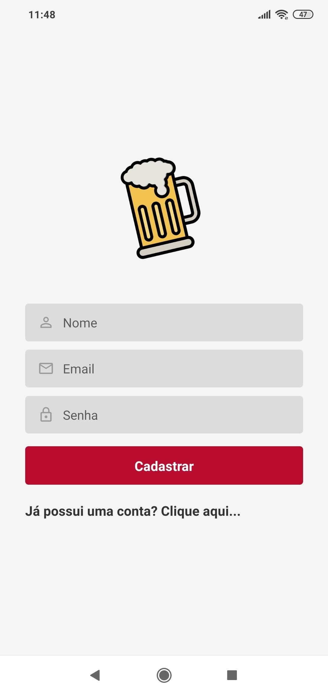
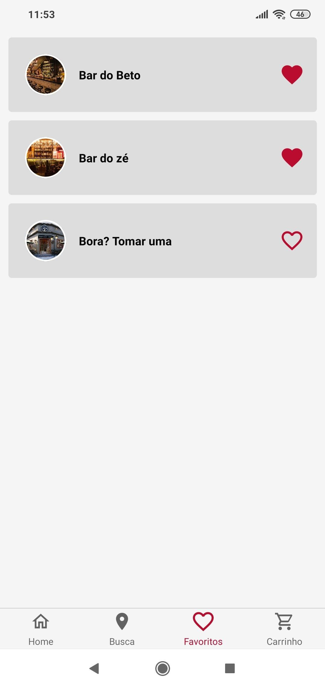

<h1 align="center">
    ShowPe
</h1>

 
  A aplicação foi desenvolvida para o desafio da Ambev, do Mega Hack 3.0 da Shawee, o aplicativo permite que o usuário consiga procurar bares próximos a ele, com boas avaliações e promoções direcionados a produtos da Ambev. Além de poder fazer seu pedido via aplicativo, podendo pagar a conta por app também, viabilizando um tempo menor de espera dentro do bar.

## Aplicação

  <table>
    <tr>
      <th width="50%">
        Login
      </th>
      <th width="50%">
        Cadastro de usuários
      </th>
    </tr>
    <tr>
      <td>
        
      </td>
      <td>
        
    </td>
    </tr>
  </table>

  <table>
    <tr>
      <th width="50%">
        Home
      </th>
      <th width="50%">
        Busca de Bares
      </th>
    </tr>
    <tr>
      <td>
        
      </td>
      <td>
        
    </td>
    </tr>
  </table>

  <table>
    <tr>
      <th width="50%">
        Favoritos
      </th>
      <th width="50%">
        Carrinho
      </th>
    </tr>
    <tr>
      <td>
        
      </td>
      <td>
        
    </td>
    </tr>
  </table>

## Para rodar a aplicação

  * A primeira coisa é executar o comando yarn ou npm install,
  para instalar todas as dependencias necessárias.

  * Após a execução do comando yarn ou npm install efetue yarn web.

  * Para rodar a aplicação mobile é preciso instalar o Expo 
  no seu celular, quando você rodar a aplicação Mobile com o comando yarn
  web, o seu navegador irá abrir mostrando um QrCode, abra o Expo no seu
  celular, e clique na opção "Scan QR Code", aponte a câmera para o QrCode
  e aproveite para fazer testes no Proffy. 

## Tecnologias

  * React-Native (Mobile Front-End);

  * Styled Components (Usado para estilizar os componentes).

